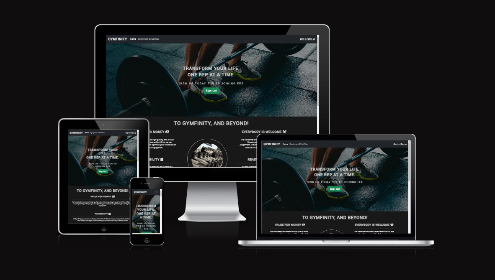
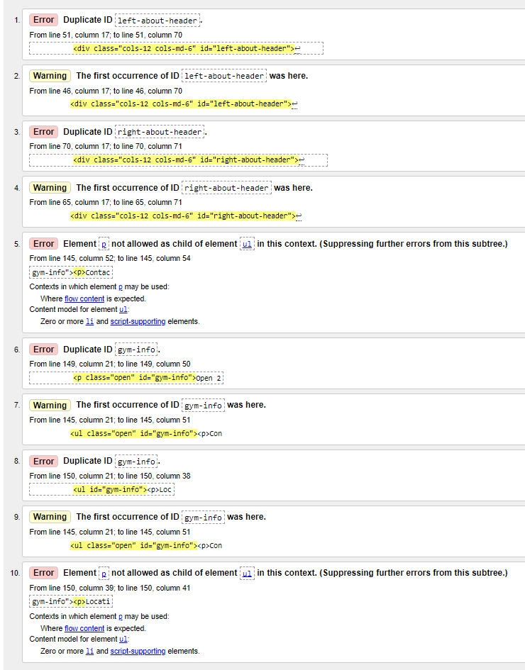
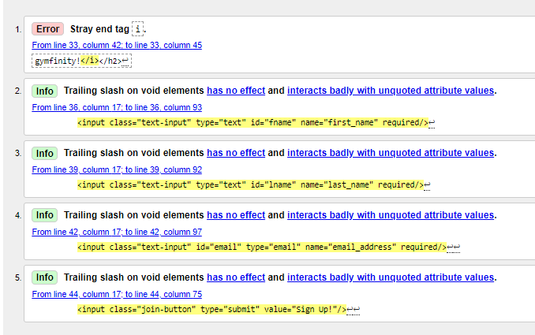
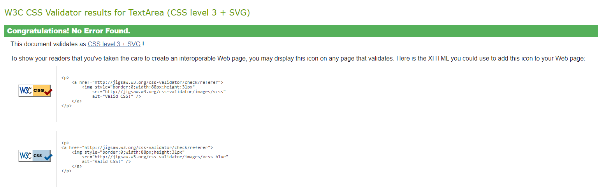

# Gymfinity
A front-end website project for a fictional gym. The aim of the website is to attract potential and retain members, whilst providing information about the gym, its facilities and organised classes.

Link to the website can be find here: [Gymfinity](https://lestercantor.github.io/gymfinity/index.html)

Link to repository can be find here: [GitHub Respository](https://github.com/lestercantor/gymfinity)
# User Stories
As the site owner, my goals are:
* To promote a healthier lifestyle
* To motivate members to join

User goals for the website are:
* As a first-time visitor, I want to easily find information about the gym (location and opening hours) so that I can make a decision to join
* As a first-time visitor, I want to see pictures of the equipment the gym provides
* As a first-time visitor, I want to easily find the sign up page 
* As a first-time or recurring visitor, I want to easily find information on the classes and their schedule
* As a recurring visitor, I want everything that I saw the first time I visited

# UXD (User Experience Design)
### Strategy
The purpose of the website is to attract new members to sign up for the gym and to retain current members. My target audience are for people aged 16+ and for all levels of fitness. The website will be able to offer the user's goals by ensuring that navigating through the website is simple and the information they need will be clear and concise. Since most, if not all, users of the intended audience have access to mobile phones, it is important that the website is responsive.
### Scope
For a comfortable user experience, features will include:
* Navigation bar to navigate through different pages. A collapsed menu bar to be in place for smaller screens
* Home page providing information about the gym and why to sign up
* Section in the home page detailing the schedule of classes so it's easily visible
* A page dedicated to showing the gym equipment and facilities
* Sign up form 
### Structure
The website will have 3 pages: Home -> Equipment & Facilities -> Sign up. Users can scroll through the home page to find most of the information as it will be the main body of information. Blocks of text will be kept short with images and icons to keep the user's attention and to not overwhelm them. There will be a simple sign up form for users to sign up.
### Skeleton
[Mobile Wireframe Mockup](/docs/mobile%20wireframe%20mockup.png)

[Desktop Wireframe Mockup](/docs/desktop%20wireframe%20mockup.png)
### Surface
I will have a dark navigation bar, contrasted with a light background for the main body of the page so the navigation bar clearly anchors the top of the page for users to see. The light background for the main page is so that the information is clearly striking to attract the attention of the user. 

A simple font like "Roboto" from Google fonts will used as it is clear and easily readable. My aim is to have the images to attract the user's attention whilst having text accompanying it to convey the information.

# Features
I intended to design the website mobile first, however, I found it easier to design it desktop first to then make it responsive for smaller screens. There are 3 pages: a home page, a page showcasing equipment and facilities and a sign up page. All pages use the font 'Roboto' for website consistency.

[Link to responiveness](https://ui.dev/amiresponsive?url=https://lestercantor.github.io/gymfinity/index.html)

## Navbar
I have a navigation bar so it's easy for users to navigate through the website. There is a collapsed navbar with a button for mobile users so the bar looks cleaner for the smaller screens, whilst making it accessible for the user.

## Footer
There is a footer for social media links and the basic information about the gym which is across all pages so the user has easy access to them at any time.

## Carousel showcasing gym equipment
In the wireframe mockup, I have a boxed section dedicated to showcase the equipment provided. My idea was to have a carousel of images showing gym equipment (taken from a royalty free website) and the user can click/tap the arrows to scroll through the images easily. This could be done through Bootstrap as it has simple carousel component which can be found through [this link](https://getbootstrap.com/docs/5.0/components/carousel/). 
Some of the images that were part of the carousel blended in with the carousel slider arrows which did not make for a good user experience. As such, I used darker arrows and lighter images to contrast each other making it clearly visible to the user. Lastly, I made sure the images in the carousel were the same dimensions so that when the user navigates through the different images in the carousel, the page would not have to adjust depending on the different sized image. Having that section of the page adjust whenever a user would scroll to an image would make for a bad user experience as they would see the container get smaller and bigger as they preview the equipment.

As a side note: since the carousel is a component of Bootstrap, the only colours they provide are black and white, where black has to be specified through the class "carousel-dark". With some research, I found that you can change the colour of the carousel slider arrow by overriding the class "carousel-control-next-icon" and giving it the background image of: `url("data:image/svg+xml,%3csvg xmlns='http://www.w3.org/2000/svg' viewBox='0 0 16 16' fill='%23fff'%3e%3cpath d='M4.646 1.646a.5.5 0 0 1 .708 0l6 6a.5.5 0 0 1 0 .708l-6 6a.5.5 0 0 1-.708-.708L10.293 8 4.646 2.354a.5.5 0 0 1 0-.708z'/%3e%3c/svg%3e")` - changing `fill='%23xxx'`, where xxx is a hexadecimal colour code. Credit to this [video](https://www.youtube.com/watch?v=ue-xn_x3ZT0)

# User Story Testing 
**As a first-time visitor, I want to easily find information about the gym (location and opening hours) so that I can make a decision to join**
As soon as the user enters the website, they can clearly see what the gym has to offer with information about flexibility and support from a personal trainer, should they have the need. Scrolling down to the footer, I can see the contact information and location of the gym.

As the site owner, I feel that having the location and contact information in the footer across all pages makes it easier so the user does not have to go to a specific page to find the information. Although, the user may not see that information at first, I believe that encouraging them to join the gym should be the first thing that sticks out when opening the website so that the user feels more inclined to join.

**As a first-time visitor, I want to see pictures of the equipment the gym provides**
As a user, I can clearly see the navigation bar at the top, with text that says "Equipment & Facilities". Upon clicking/tapping that text, I am taken to a page where I can clearly see gym equipment, with faint arrows indicating there's more pictures to be shown. 

Scrolling down slightly, I can clearly see facilities the gym provides with appropriate icons to further capture the different facilities.

**As a first-time visitor, I want to easily find the sign up page**
As a user, I can clearly see the navigation bar at the top, with text that says "Sign In / Sign Up" and on the initial landing page there is a big green button that says "Sign Up!". Clicking on the button brings me to this page: 

**As a first-time or recurring visitor, I want to easily find information on the classes and their schedule**
As a user, I can find the classes and schedule by scrolling down from the Home page. As a recurring visitor, having it stay in the same page means I know where to look should I need a reminder of what is happening on that day. 

As the site owner, developing a dynamic schedule which updates regularly would be difficult and out of my scope, so I have decided to have a static schedule based on my own routine. If I were to update the schedule, I would keep the section where it is on the page so that recurring visitors can instinctively scroll down to the section.

**As a recurring visitor, I want everything that I saw the first time I visited**
As a recurring user, the information I have seen the first time I visited is still there. 

# Validator Testing
### HTML Validation

From the [w3c validator website](https://validator.w3.org/nu/?doc=https%3A%2F%2Flestercantor.github.io%2Fgymfinity%2Findex.html), I have errors and warnings about duplicate ID's used, however, I am not sure of a solution to the problem as I needed the same styles for the tags that were used. Since I needed the same styles for the footers, the same errors and warnings are across each page. Another issue I am not sure of how to fix is to make the paragraph tag in the footer to be part of the unordered list, as I needed the list style and tags to make the footer content as it is.

To fix these errors, I realised that ID's are used for unique changes, so having multiple ID's being used was against the validity in the HTML validation. My solution to fix this was to make them a class so that multiple elements can have the styling that I want. 
The other I needed to fix were 2 cases of where a `p` element was not a child of the `li` element. My solution was to make the `p` element a child of an `li` element, the `ul` element expects an `li` element as its child - which lets me embed a `p` element inside the `li` element so that I can keep the layout as it was before whilst maintaining validity. Since this was an error in the footer, which I have across all pages, the changes have been adjusted to each page. 

Whilst validating all of my pages, I came across these errors in the sign up page. Being able to validate through direct input makes it easier to see HTML errors so that they can be easily rectified without waiting for deployment. These particular errors were easy to fix as I just needed to delete trailing slashes and a rogue </i> on line 33 as mentioned by the validator. 

### CSS Validation

Passing my direct code through [w3c jigsaw css validator](https://jigsaw.w3.org/css-validator/validator), my CSS stylesheet passed with no errors found.

# Responsiveness Testing
For the responsiveness testing, I mainly used the dimensions for Samsung Galaxy A51/71, as I assume my intended audience will have a modern and affordable smartphone. I collapsed the navigation bar, as the texts and buttons would fill up the top of the user's screen, making for a bad user experience.

When the user presses the burger icon, the navigation bar reveals the other pages that the user can navigate to: 

### Home Page
In my mobile wireframe mockup, I removed the centre image on the four reasons to join section, as it would have been too bulky and ultimately make the text unreadable. I had intended to keep the image there, but went back on the decision because of the reason before. Now the mobile user experience looks like this:

As well as this, the desktop version of the classes were laid out horizontally. This was not going to work in the mobile experience, so I laid them out vertically and making sure the spacing for each box was even.

At the very bottom, the user is still able to see the footer and all of its contents. Since the styling and layout are used across all pages, the look of the footer will remain the same across all pages as well.

### Equipment & Facilities Page
In the equipment & facilities page, the user is still able to clearly see the gym equipment, even though the images on the carousel are made smaller to fit the screen for the smartphone. On the desktop version, the facilities of the gym could fit in one row, but on the mobile screen, I made sure to fit the text and icons into two rows, so the icons and text would not have to shrink.

The carousel component still works on the mobile screen as the Bootstrap framework is designed to be responsive.

### Sign Up Page
The sign up form is now centred on the mobile screen instead of it being offset like the desktop.

# Deployment
My website was deployed through GitHub Pages. To deploy it, these steps were followed:
* Open the GitHub Repository
* Click 'Settings'
* Click 'Pages' on the left
* From the Source button: select Deploy from a branch
* From the Branch button: select main and /root
* Click Save

# Technologies Used
* [HTML](https://developer.mozilla.org/en-US/docs/Web/HTML) was used as the basic foundation for the website
* [CSS](https://developer.mozilla.org/en-US/docs/Learn/Getting_started_with_the_web/CSS_basics) was used to style the website
* [Bootstrap](https://getbootstrap.com/) was used to help build the website through their CSS libraries
* [Google Fonts](https://fonts.google.com/) was used to obtain custom fonts 
* [Font Awesome](https://fontawesome.com/) was used to obtain icons
* [Google Developer Tools](https://developer.chrome.com/docs/devtools/) was used to inspect different elements and see responsiveness 
* [GitHub](https://github.com/) was used to store code repository and to deploy website
* [W3C Markup Validation](https://validator.w3.org/) was used to validate the HTML
* [W3C CSS Validation](https://jigsaw.w3.org/css-validator/#validate_by_input) was used to validate the CSS
* [Unsplash](https://unsplash.com/) was used to download free images for the website (as it was for a fictional gym)
* [Pixlr](https://pixlr.com/e/#editor) was used to crop and resize images to better suit the website